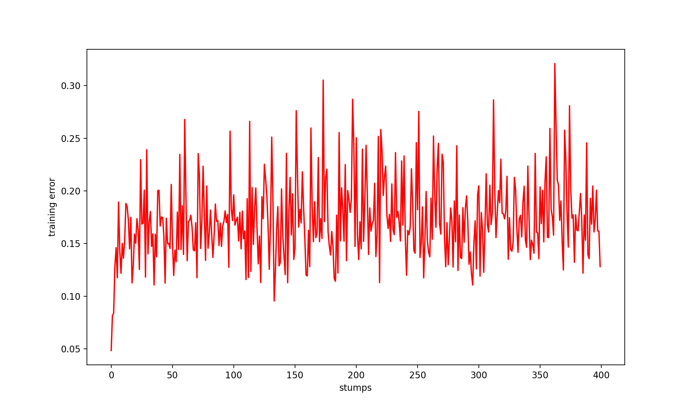

# AdaBoost

Implementation of Adaptive Boosting that weights weak learners to provide a consensus-based prediction.

## Performance
With 400 weak learners (Decision Trees with max. depth of 2), we reach an accuracy of ~65% on the Breast Cancer dataset. Here's the error bar for each classifier:

